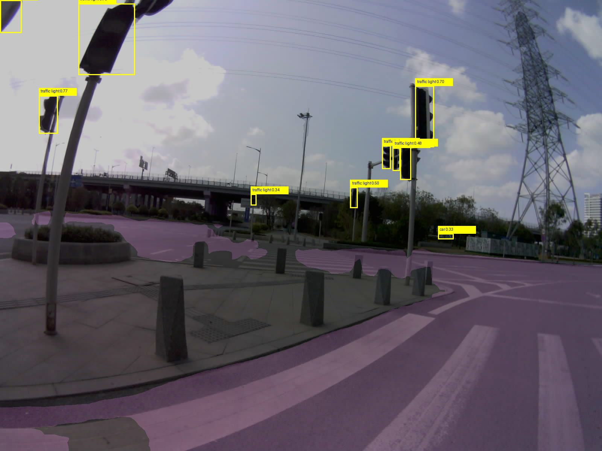
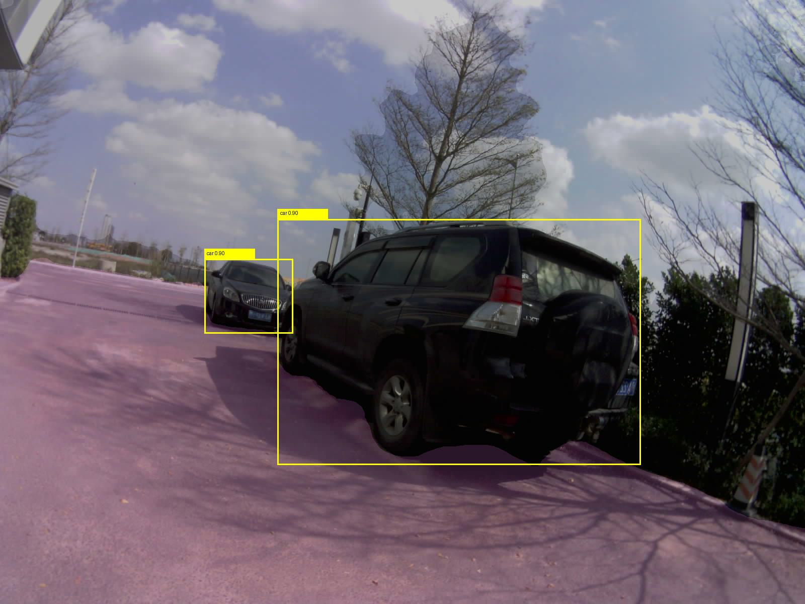
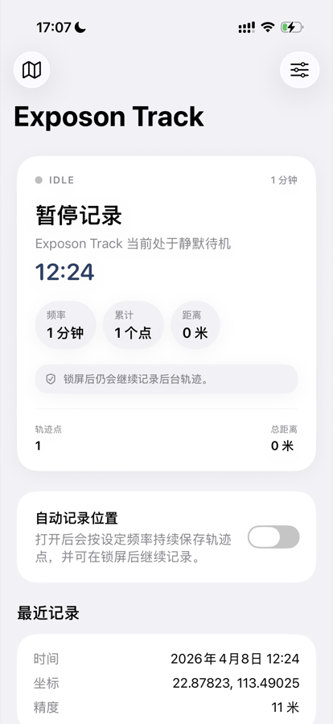

# Exposon

**Mobile sensing devices for urban environment research**  
**用移动传感器感知城市环境**

---

## Open-Source Status | 开源状态

This repository currently includes the open-source materials for **Exposon Cam** and **Exposon Air**.  
**Exposon Track** is now available on the [App Store](https://apps.apple.com/cn/app/exposon-track/id6761625047).  
**Exposon Thm** will be open-sourced later.  
The source code for **Exposon Track** will also be released later.

本仓库目前开放 **Exposon Cam** 和 **Exposon Air** 的相关内容。  
**Exposon Track** 已上架 [App Store](https://apps.apple.com/cn/app/exposon-track/id6761625047)。  
**Exposon Thm** 将在后续开源。  
**Exposon Track** 的源码也将在后续开源。

---

## Project Overview | 项目简介

Exposon focuses on urban mobility research through mobile sensing devices and lightweight software tools.  
The current repository centers on three project lines:

- **Exposon Cam**: street-scene capture, route logging, and semantic segmentation
- **Exposon Air**: air-quality sensing and personal exposure monitoring
- **Exposon Track**: iOS app for GPS track recording and field logging

Exposon 关注城市环境中的移动研究，通过移动传感设备与轻量软件采集街景、空气质量与轨迹相关数据。  
当前仓库主要包含三条项目线：

- **Exposon Cam**：街景采集、路线记录与语义分割
- **Exposon Air**：空气质量感知与个体暴露监测
- **Exposon Track**：用于 GPS 轨迹记录与外场采集的 iOS 软件

---

## Exposon Cam

**Street-scene capture device for mobile field research**  
**面向移动外场研究的街景采集设备**

Exposon Cam is designed for route-level visual recording in urban environments.  
It integrates imaging, motion sensing, environmental sensing, and positioning for synchronized mobile data collection.

Exposon Cam 用于城市环境中的路线级视觉记录，集成图像、运动、环境与定位信息，实现同步采集。

### Hardware | 硬件配置

| Module | Model | Notes |
|:---|:---|:---|
| Core | ESP32-S3 | Low-power edge computing |
| Camera | OV5640 | Street-scene image capture |
| IMU | MPU6050 | Motion and vibration sensing |
| Environmental | AHT20 + BMP280 | Temperature, humidity, pressure |
| GNSS | NEO-8M | Positioning and UTC time reference |

### Data Output | 数据输出

- Street-scene images
- Route-level timestamps and coordinates
- IMU and environmental records
- Segmentation-ready visual samples

- 街景图像
- 路线级时间与坐标记录
- IMU 与环境数据
- 可用于后续分割分析的样本

### Typical Use Cases | 典型应用

- Street-scene documentation in urban routes
- Semantic segmentation sample collection
- Mobility behavior and route environment analysis

- 城市路线街景记录
- 语义分割样本采集
- 人类移动与路线环境分析

---

## Exposon Air

**Personal exposure monitoring device for mobile environmental studies**  
**面向移动环境研究的个体暴露监测设备**

Exposon Air is built for continuous sensing of air quality and personal exposure in motion.  
It records particulate matter, VOC, micro-environment variables, motion status, and route information.

Exposon Air 用于移动过程中的空气质量与个体暴露连续监测，记录颗粒物、VOC、微环境、运动状态与路线信息。

### Hardware | 硬件配置

| Module | Model | Notes |
|:---|:---|:---|
| Core | ESP32-S3 | Main controller |
| Air sensor module | Integrated module | PM2.5 / PM10 / VOC / temperature / humidity |
| IMU | MPU6050 | Motion sensing |
| GNSS | NEO-8M | Positioning and route logging |

### Data Output | 数据输出

- PM2.5 / PM10
- VOC
- Temperature and humidity
- Motion and route records

- PM2.5 / PM10
- VOC
- 温湿度
- 运动与轨迹记录

### Typical Use Cases | 典型应用

- Personal exposure assessment
- Mobile air-quality monitoring
- Urban environmental health studies

- 个体暴露评估
- 移动空气质量监测
- 城市环境健康研究

---

## Exposon Track

**iOS app for GPS track recording and field logging**  
**用于 GPS 轨迹记录与外场采集的 iOS 软件**

Exposon Track is built for route recording in research, commuting, and outdoor scenarios.  
It supports adjustable logging frequency, stable background recording, and easy track export.

Exposon Track 面向科研外业、通勤与户外场景，支持记录频率调节、后台稳定记录与轨迹导出。

[Download on the App Store](https://apps.apple.com/cn/app/exposon-track/id6761625047)  
[在 App Store 查看](https://apps.apple.com/cn/app/exposon-track/id6761625047)

### Key Features | 主要功能

- GPS track recording
- Adjustable logging interval
- Stable background running
- Easy export for research workflows

- GPS 轨迹记录
- 记录频率可调
- 后台稳定运行
- 便于接入研究工作流的轨迹导出

---

## Roadmap | 后续计划

- Open-source release of **Exposon Thm**
- Open-source release of the **Exposon Track** source code
- Further integration of visualization and field workflow documentation

- 发布 **Exposon Thm** 的开源内容
- 发布 **Exposon Track** 源码
- 继续整理可视化与外场工作流文档

---

## Contact | 联系方式

**Shanbo Qi**  
qishanbo@outlook.com
